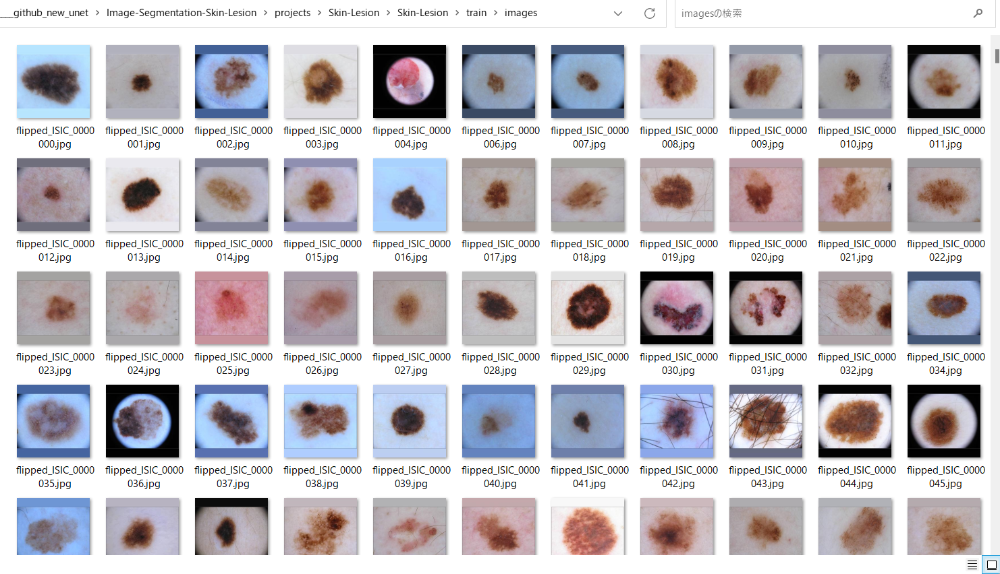
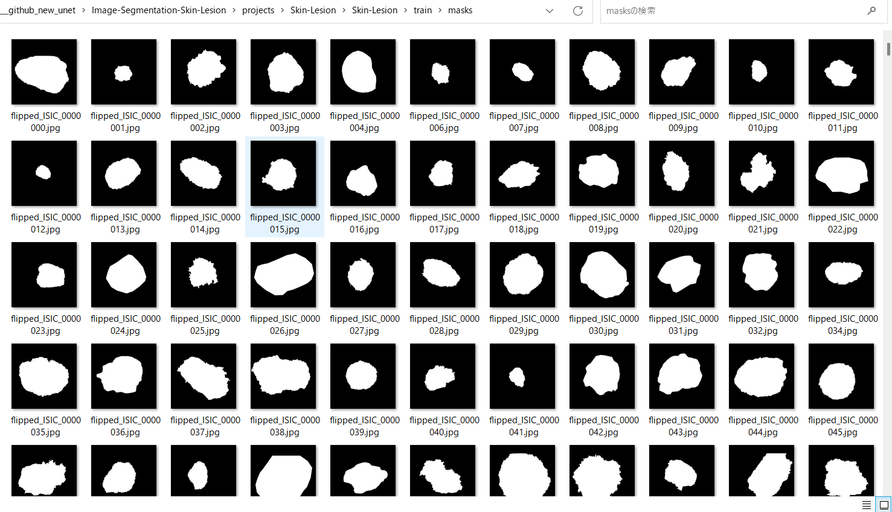
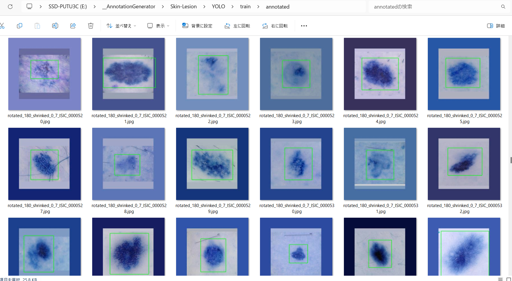

<h2>Skin-Lesion-Image-Dataset (2024/01/21) 
</h2>
This is a Skin-Lesion Dataset for Image-Segmentation and Object Detection. 
Please see also our first experiment <a href="https://github.com/sarah-antillia/Image-Segmentation-Skin-Lesion">Image-Segmentation-Skin-Lesion</a> 
 

<h3>1. Dataset Citation</h3>

The image dataset used here has been taken from the following web site. 

<pre>
ISIC Challenge Datasets 2017
https://challenge.isic-archive.com/data/
</pre>

<b>Citing 2017 datasets:</b>
<pre>
Codella N, Gutman D, Celebi ME, Helba B, Marchetti MA, Dusza S, Kalloo A, Liopyris K, Mishra N, Kittler H, Halpern A.
 "Skin Lesion Analysis Toward Melanoma Detection: A Challenge at the 2017 International Symposium on Biomedical Imaging (ISBI),
  Hosted by the International Skin Imaging Collaboration (ISIC)". arXiv: 1710.05006 [cs.CV]
</pre>
<b>License: CC-0</b> 
 
See also: 

<a href="https://paperswithcode.com/dataset/isic-2017-task-1">ISIC 2017 Task 1</a> 
<pre>
Introduced by Codella et al. in Skin Lesion Analysis Toward Melanoma Detection: 
A Challenge at the 2017 International Symposium on Biomedical Imaging (ISBI), 
Hosted by the International Skin Imaging Collaboration (ISIC)
</pre>
<pre>
The ISIC 2017 dataset was published by the International Skin Imaging Collaboration (ISIC) as a large-scale dataset 
of dermoscopy images. The Task 1 challenge dataset for lesion segmentation contains 2,000 images for training with 
ground truth segmentations (2000 binary mask images).
</pre>
 

<h3>
2. Download master dataset
</h3>
  Please download the original Test, Train, Valid image and mask dataset <b>ISIC Challenge Datasets 2017</b> from the following link 

<pre>
ISIC Challenge Datasets 2017
https://challenge.isic-archive.com/data/
</pre>

The dataset <b>ISIC-2017</b> has the following folder structure. 

<pre>
./ISIC-2017
├─ISIC-2017_Test_v2_Data
├─ISIC-2017_Test_v2_Part1_GroundTruth
├─ISIC-2017_Training_Data
├─ISIC-2017_Training_Part1_GroundTruth
├─ISIC-2017_Validation_Data
└─ISIC-2017_Validation_Part1_GroundTruth
</pre>
Image  *_Data folders contain jpg image files of various size from 1K to 4K, and mask dataset *_GroundTruth 
folders contain the segmention png files corresponding to the images in *_Data folders.

<h3>
3. Create ImageMask Ddataset
</h3>
3.1 Create image and mask dataset
</h3>
By using Python script <a href="./generator/ImageMaskDatasetGenerator.py">ImageMaskDatasetGenerator.py</a>,
 we have created <b>Skin-Lesion</b> dataset from the original jpg image files in <b>*_Data</b> folders and png mask files in 
 <b>*_GroundTruth</b> folders. 
The script performs the following image processings. 
<pre>
1 Create 256x256 square images from original image files.
2 Create 256x256 square mask  corresponding to the image files. 
3 Create rotated, flipped, and mirrored images and masks to augment the resized square images and masks.
</pre>

The created <b>Skin-Lesion</b> dataset has the following folder structure. 
<pre>
./Skin-Lesion
├─test
│  ├─images
│  └─masks
├─train
│  ├─images
│  └─masks
└─valid
    ├─images
    └─masks
</pre>
<b>train/images samples:</b> 

 
<b>train/masks samples:</b> 

 

<h3>
4.Generate Annotation file
</h3>
<h3>
4.1 Generate YOLO Annotation
</h3>
To generate YOLO Anntotation files from the Skin-Lesion datasets, 
please run Python script <a href="./YOLOAnnotationGenerator.py">YOLOAnnotationGenerator.py</a>. 
<pre>
python YOLOAnnotationGenerator.py
</pre>

This command generates the following YOLO folders, which contains <b>test</b>, <b>train</b> and <b>valid</b> 
<pre>
./YOLO
├─test
│  └─annotated
├─train
│  └─annotated
└─valid
    └─annotated
</pre>
For example, train folder contains a lot of jpg image files, yolo annotation text files, and annotated folder,
 
<pre>
train
├─annotated
├─rotated_0_shrinked_0_7_ISIC_0000000.jpg
├─rotated_0_shrinked_0_7_ISIC_0000000.txt
├─rotated_0_shrinked_0_7_ISIC_0000001.jpg
├─rotated_0_shrinked_0_7_ISIC_0000001.txt
...
</pre>
Annotated folder contains jpg image files with bounding boxes as shown below. 
 
 

<h3>
4.2 Generate TFRecord train and valid dataset
</h3>
By using <a href="https://github.com/sarah-antillia/AnnotationConverters">AnnotationConverter</a>,
we have generated TFRecord dataset from train and valid dataset in YOLO annotation. 
<pre>
TFRecord
├─train
└─valid
</pre>

<h3>
4.3 Generate COCO test dataset
</h3>
By using <a href="https://github.com/sarah-antillia/AnnotationConverters">AnnotationConverter</a>,
we have generated COCO dataset from <b>test</b> dataset in YOLO annotation. 
<pre>
COCO
└─test
</pre>

<h3>
5. Skin-Lesion Dataset for EfficientDet
</h3>
We have finally created the following <b>Skin-Lesion-EfficientDet-Dataset</b> for 
<a href="https://github.com/google/automl/tree/master/efficientdet">efficientdet</a> object detection from TFRecord(train, valid) and COCO(test) dataset.
<pre>
Skin-Lesion-EfficientDet-Dataset
├─test
├─train
└─valid
</pre>

You can download this dataset from the googole drive 
<a href="https://drive.google.com/file/d/19OHk0N7FhkNvR7j60RX-qYMtzbkfTTUy/view?usp=sharing">
Skin-Lesion-EfficientDet-Dataset.zip</a>

